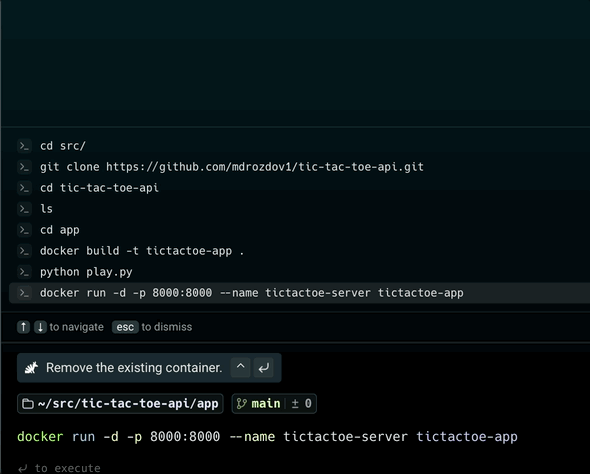

# Tic-Tac-Toe API

A containerized, full-stack Tic-Tac-Toe game featuring a FastAPI server, SQLModel for persistence, and a terminal-based interactive client.


---

## Features

* RESTful API: Create games, make moves, and view history via HTTP endpoints.
* Dynamic Board Size: Supports grids from 3x3 up to 10x10.
* Automated Opponent: Includes a random-move AI (Player O) that responds immediately to your moves.
* Data Persistence: Uses SQLite via SQLModel to store game states and move history.
* ASCII Visualization: A custom board formatter provides a clear visual state in your terminal.

---

## Tech Stack

* Language: Python 3.11
* Framework: FastAPI
* Database: SQLite and SQLModel
* Containerization: Docker
* Testing: Pytest and HTTPX

---

## Prerequisites

* Docker
* Python 3.11 or higher (to run the client script locally)

---

## Getting Started

### Build and Run with Docker
Build the image and start the server container on port 8000:
```bash
docker build -t tictactoe-app .
docker run -d -p 8000:8000 --name tictactoe-server tictactoe-app
```

### Play the Game
Once the server is running, launch the interactive terminal client:

```bash
python play.py
```

Note: Ensure you have the requests library installed.

### API Documentation
Once the server is running, you can access the interactive Swagger UI documentation at:
`http://localhost:8000/docs`

### API Reference
#### Games
- POST `/games?size=3`: Create a new game session.

- GET `/games`: List all active and completed games.

- GET `/games/{game_id}/moves`: View the full chronological history for a specific match.

#### Gameplay
- POST `/games/{game_id}/move`: Submit a move for Player X.
  - Input: JSON coordinates { "x": int, "y": int }.

### Testing
The project includes a suite of tests covering database initialization, game logic, and API edge cases.

To run the tests inside the container:

```bash
docker exec -it tictactoe-server pytest
```
